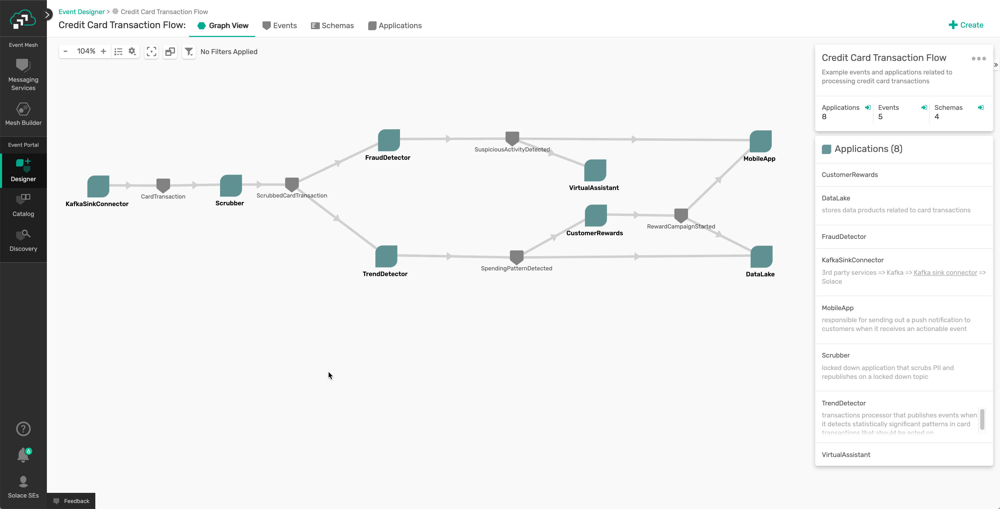
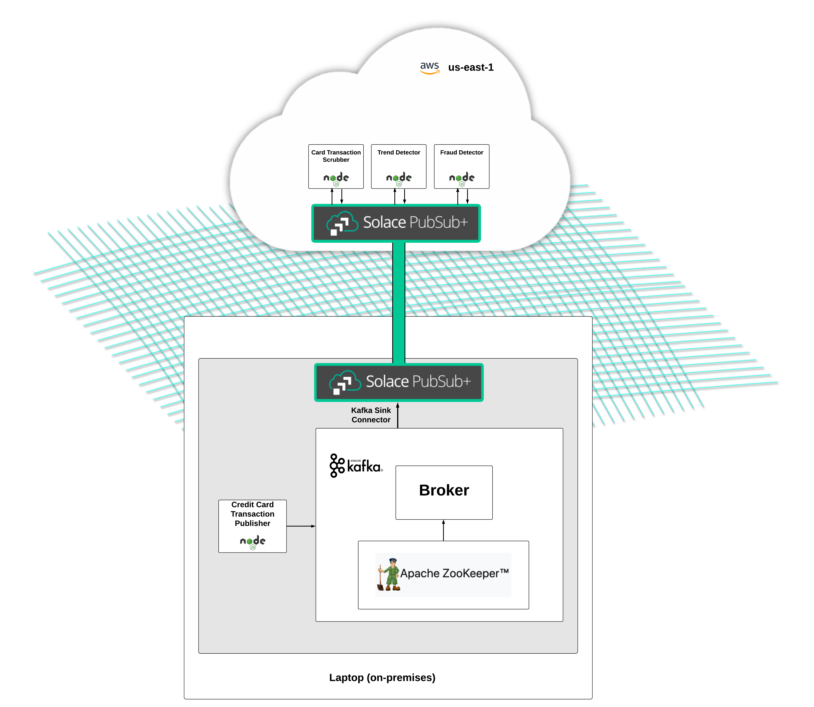

# Card transactions demo

This is an end-to-end demo that implements some contrived event flows related to credit card transactions.

## Uses

- [kafka-node](https://github.com/SOHU-Co/kafka-node)
- [Solace PubSub+ Connector for Kafka: Sink](https://github.com/SolaceProducts/pubsubplus-connector-kafka-sink#overview)
- [MQTT.js](https://github.com/mqttjs/MQTT.js)

## Event Portal Link for Solace SEs

https://console.solace.cloud/event-designer/domains/32utcxr6mf2p

## Event Portal Application Domain Graph



## Architecture Diagram



## Staging the demo environment

You'll need to start a local Solace software broker, a Solace Cloud messaging service, and get Kafka, ZooKeeper, and the Solace PubSub+ Kafka Connector: Sink running locally.

Follow the [documentation found on the Sink Connector's GitHub page](https://github.com/SolaceProducts/pubsubplus-connector-kafka-sink#quick-start) to get up and running with everything Kafka related.

When you have Kafka up and running, create a new topic using a more descriptive name than "test" by running this command:

```sh
bin/kafka-topics.sh --create --bootstrap-server localhost:9092 --replication-factor 1 --partitions 1 --topic card-transaction
```

Make these associated change in the `etc/solace_sink.properties` of the PubSub+ Kafka Sink Connector:

```sh
topics=card-transaction
sol.topics=PII/CardTransaction
```

## Running the applications

First, clone the repo and cd into its root directory:

```
git clone https://github.com/solacese/card-transactions.git
cd card-transactions
```

If you look at the contents of the [applications directory](./applications), you'll find four small Node.js applications that do some basic transformations and phony business logic to make the event flows look real:

- [card-transactions-publisher](./applications/card-transactions-publisher)
- [scrubber](./applications/scrubber)
- [fraud-detector](./applications/fraud-detector)
- [trend-detector](./applications/trend-detector)

There's a README for each application, but they're all pretty much the same:

```
cd <application directory>
npm i
npm run start
```
